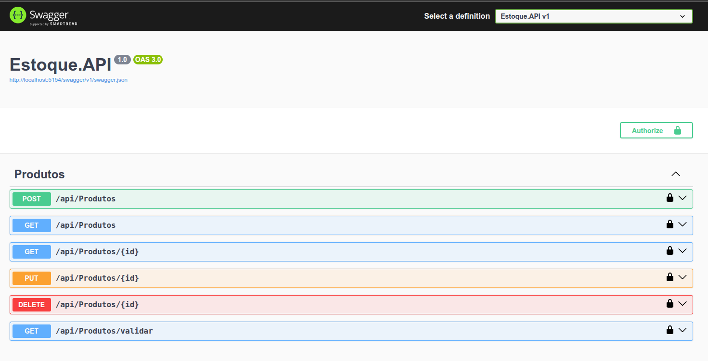
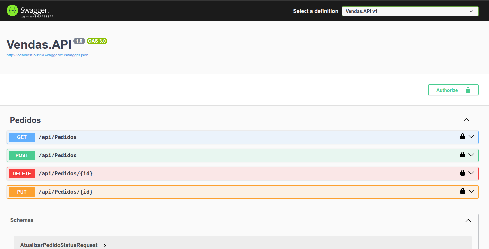

## 🛒 E-commerce Microservices: Gestão de Estoque e Vendas

Este projeto apresenta uma arquitetura de microserviços desenvolvida em .NET 8, voltada para o gerenciamento de estoque e processamento de vendas, simulando o backend de uma plataforma de e-commerce moderna.

A solução adota princípios de escalabilidade, independência de serviços, comunicação assíncrona e segurança por autenticação.

## 🧩 Arquitetura da Solução

A plataforma é composta pelos seguintes componentes:

- 🔐 **Auth.API** — Serviço de autenticação JWT

- 📦 **Estoque.API** — Gestão de produtos e controle de estoque

- 🧾 **Vendas.API** — Processamento de pedidos e integração via mensageria

- 🌐 **API Gateway** (Ocelot) — Roteamento centralizado

- 📬 **RabbitMQ** — Comunicação assíncrona (event-driven) entre serviços

<br>

## 🚀 Tecnologias e Ferramentas

| Componente   | Tecnologia                | Descrição                                           |
| ------------ | ------------------------- | --------------------------------------------------- |
| Backend      | **.NET 8 (C#)**           | Desenvolvimento das APIs REST                       |
| Mensageria   | **RabbitMQ**              | Event Bus para baixa e confirmação de estoque       |
| Persistência | **Entity Framework Core** | ORM com SQL Server (ou SQLite/InMemory para testes) |
| Segurança    | **JWT**                   | Autenticação e autorização                          |
| Gateway      | **Ocelot**                | Roteamento centralizado de microserviços            |
| Testes       | **xUnit / Moq**           | Testes unitários                                    |

<br>

## 🧭 Microserviços

### 🔐 Auth.API — Autenticação e Emissão de JWT

Responsável pela validação de credenciais e emissão de tokens de acesso.

▶️ **Endpoint de Login**

```http
POST /api/auth/login
```

Exemplo de corpo:

```json
{
  "username": "admin",
  "password": "123456"
}
```
📸 **Interface (Swagger)**


### 📦 Estoque.API — Gestão de Produtos

Gerencia o cadastro de produtos, quantidade disponível e validação para baixa de estoque.

▶️ **Endpoints Principais:**

- **POST** /api/Produtos

- **GET** /api/Produtos

- **GET** /api/Produtos/{id}

- **PUT** /api/Produtos/{id}

- **DELETE** /api/Produtos/{id}

- **GET** /api/Produtos/validar

📸 **Interface (Swagger)**



### 🧾 Vendas.API — Processamento de Pedidos

Gerencia pedidos, envia solicitações de baixa de estoque e consome eventos do RabbitMQ.

▶️ **Endpoints Principais:**

- **GET** /api/Pedidos

- **POST** /api/Pedidos

- **DELETE** /api/Pedidos/{id}

- **PUT** /api/Pedidos/{id}

📸 **Interface (Swagger)**



### 🌐 API Gateway — Ocelot

Responsável pela centralização das rotas e comunicação entre clientes e microserviços.

Exemplo de chamada:

```bash
GET http://localhost:5197/estoque/api/Produtos
```
<br>

## ⚙️ Configuração e Execução
### 📌 Pré-requisitos

- .NET 8 SDK

- Docker (para rodar RabbitMQ e SQL Server) 

- Banco de dados relacional

- VS Code, Visual Studio ou Rider

### 📌 Subindo RabbitMQ (via Docker)

```bash
docker run -d --hostname rabbit --name rabbitmq -p 5672:5672 -p 15672:15672 rabbitmq:3-management
```
Painel de administração:<br>
http://localhost:15672<br>
Usuário: **guest** <br>
senha padrão: **guest**

### 📌 Aplicando Migrations

```bash
cd Estoque.API
dotnet ef database update
```

```bash
cd Vendas.API
dotnet ef database update
```

### 📌 Execução dos Microserviços

Abra um terminal para cada microserviço:

```bash
cd ApiGateway.API && dotnet run
cd Auth.API && dotnet run
cd Estoque.API && dotnet run
cd Vendas.API && dotnet rundotnet run
```

### 📌 Execução dos Testes

```bash
cd Etoque.API.Tests
dotnet test
```
<br>

## 🧱 Arquitetura Visual


## 🧑‍💻 Desenvolvedora

**Andreza Freitas**

Soluções modernas com foco em tecnologia, desempenho e boas práticas de desenvolvimento.

## 🤝 Contribuições

Contribuições são bem-vindas!<br>
Abra uma **issue** ou envie um **pull request**.


